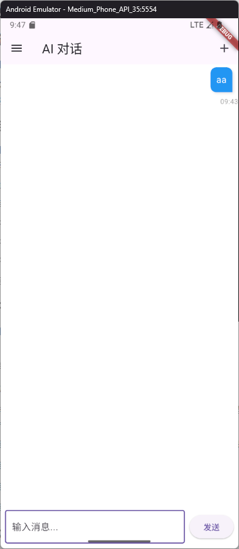
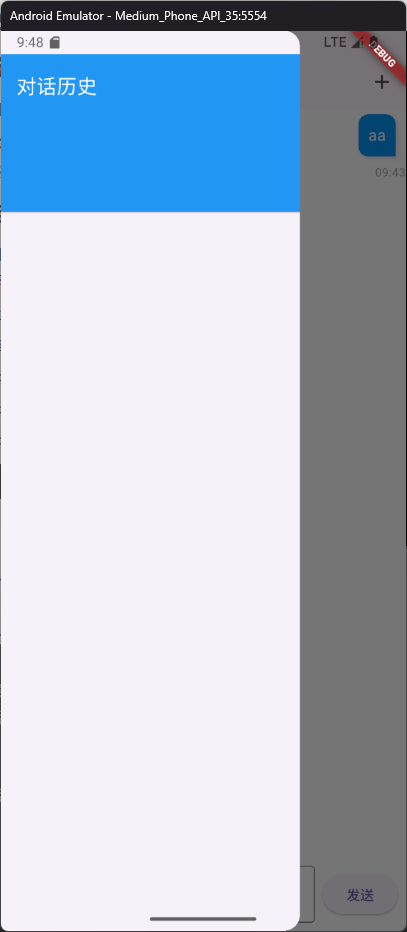

# **中期汇报文档**

---

## **1. 需求分析**

### **1.1 系统角色**
- **用户**：与大模型进行对话的主体，能够输入文字、查看历史对话、继续历史对话。
- **系统**：提供与大模型交互的功能，包括记录对话历史、加载历史对话等。

### **1.2 用户故事**
1. **作为用户**，我希望能够输入文字并发送给大模型，以便获得即时的答复。
2. **作为用户**，我希望能够查看我的对话历史，以便回顾之前的对话内容。
3. **作为用户**，我希望能够从历史对话中选择一个对话继续与大模型交互，以便延续之前的讨论。
4. **作为用户**：我希望能够发送任意格式的数据给大模型，从而减少了我自己转成文本的步骤。
5. **作为用户**：我希望能输入尽可能少的字来获取更好结果。
6. **作为用户**：我希望大模型返回的结果能直接使用，而不需要自己调整格式。

### **1.3 功能点清单**
- 支持用户输入文字并发送给大模型。
- 提供对话历史的查看功能。
- 支持从历史对话中选择并继续对话。
- 可以传入图片、视频、PPT等格式（可选）
- 可以帮助生成提示符来使得对话效果更好（可选）
- 自主选择大模型来对话（可选）
- 可选输出格式为doc、md、pdf等（可选）
- 可以添加用户自定义的知识库（可选）

---

## **2. 项目主要界面设计**

### **2.1 原型设计**

#### **1. 主界面**
- **功能描述**：
  - 用户可以输入对话内容并发送给大模型。
  - 实时展示当前对话内容。
- **界面元素**：
  - **标题**：根据用户提问内容动态生成。
  - **输入框**：供用户输入对话内容。
  - **发送按钮**：用于发送对话内容。
  - **扩展功能按钮**：可以使用扩展的功能。
  - **对话显示区域**：展示用户与大模型的对话内容。
- **界面示例**：
  - 

#### **2. 历史对话界面**
- **功能描述**：
  - 展示用户的历史对话列表。
  - 支持选择某条历史对话并加载其内容。
- **界面元素**：
  - **对话列表**：展示所有历史对话的标题。
  - **选择按钮**：点击后进入对应的对话详情界面。
- **界面示例**：
  - 

---

## **3. 项目关键的 Activity 和实现方式**

### **3.1 关键 Activity**

#### **1. 聊天界面**

#### **2. 历史对话界面**

### **3.2 实现方式**
- **前端**：使用 Flutter 框架实现界面交互。
- **后端**：提供API接口给前端实现对话以及对话历史的保存。

---

## **4. 项目主要模块设计**

### **4.1 前端模块**

#### **1. 对话模块**
- **功能描述**：
  - 实现用户与大模型的实时交互，大模型进行流式输出，或者实时进度的显示。
  - 提供输入框供用户输入对话内容，用户可以选择上传的文件，回复消息的格式等。
  - 支持扩展功能按钮，便于用户使用额外功能（如生成提示符）。

#### **2. 历史对话模块**
- **功能描述**：
  - 展示用户的历史对话列表。
  - 支持用户选择某条历史对话并加载其内容。
  - 提供搜索或者分类功能，便于用户快速查找特定对话。

### **4.2 后端模块**
- **功能描述**：

---