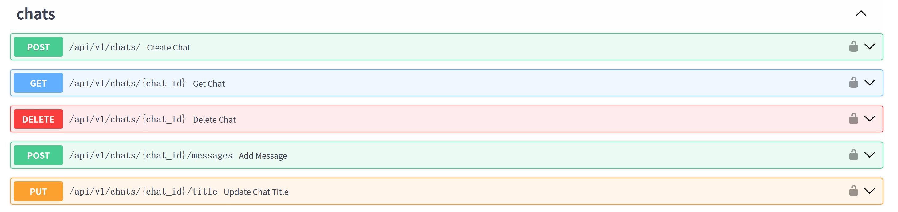
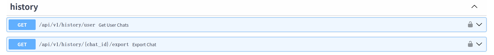
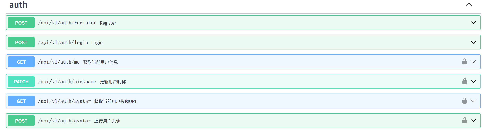

# 主要实现了以下几类api（可访问http://1.92.96.135:8000/docs#查看):
## chats 负责聊天内容的增删改查，同时允许修改聊天的标题，或者自动生成标题。利用chat_id唯一标记chat
### api/v1/chats/   method:POST   
接收参数为对话标题，使用的模型（默认default智谱模型），和最初消息（由系统指定，根据用户选择的人格发送相应的prompt）
### api/v1/chats/{chat_id}  method:GET
接收参数为chat_id，表示要查看的对话，返回该对话的历史消息
### api/v1/chats/{chat_id}  method:DELETE
删除该对话
### api/v1/chats/{chat_id}/messages     method:POST
参数为chat_id和对话内容，向模型发送新消息，返回模型的回答
### api/v1/chats/{chat_id}/title    method:PUT
参数为chat_id，用户自定义title(可选),和auto_generate的bool值，若有自定义title则改成自定义标题，若无则模型自动生成标题

## history 负责管理历史对话
### api/v1/histoty/user method:GET
不需要参数，直接返回当前用户的所有聊天的chat_id
### api/v1/histoty/{chat_id} method:GET
需要参数chat_id，返回此对话的全部内容

## auth 负责用户的注册、登录、身份信息的修改与获取
### api/v1/auth/register method:POST
接收参数用户名称、邮箱、密码、昵称，返回access_token
### api/v1/auth/login method:POST
接收用户名称密码，返回access_token
### api/v1/auth/me method:GET
不需参数，返回当前用户的所有信息
### api/v1/auth/nickname method:PATCH
接收参数用户昵称，更改用户昵称信息
### api/v1/auth/avatar method:POST
允许用户选择图片，并在用户头像存储或更新该图片
### api/v1/auth/avatar method:GET
不需参数，返回头像url

