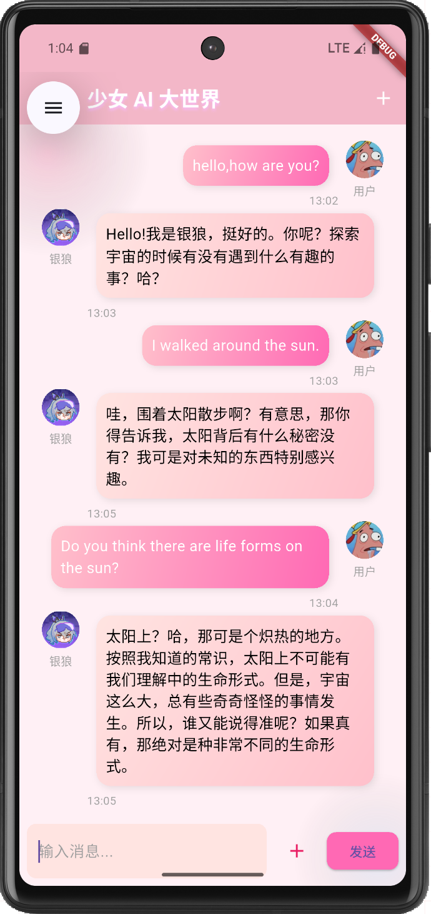
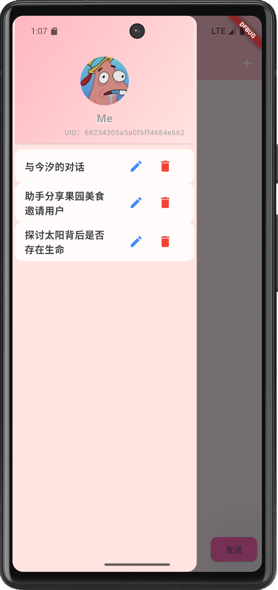

## 用户手册

### 1. 登录与注册

- 打开APP，进入登录界面，输入用户名和密码点击“登录”即可进入主界面。
- **登录页面**：
- 没有账号？点击“没有账号？点击注册”，填写昵称、用户名、邮箱、密码后注册成功即可登录。
- **注册界面**：

### 2. 选择AI少女模型

- 登录后进入模型选择界面，点击喜欢的AI少女头像即可开始与该人格对话。
- **选择模型页面**：

### 3. 聊天与消息发送

- 在聊天界面输入消息，点击“发送”按钮即可与AI少女对话。
- 支持查看历史消息，AI回复会自动显示。
- 点击右上角加号按钮会新建对话，然后会将当前对话保存到历史对话中，并自动生成标题。
- **对话页面**：

### 4. 历史对话管理

- 点击左上角菜单可展开历史对话侧边栏，支持切换、删除历史会话。
- **历史对话页面**：

### 5. 个人信息管理

- 点击侧边栏顶部头像或昵称进入个人中心，可修改头像、昵称。
- **个人页面**：

---