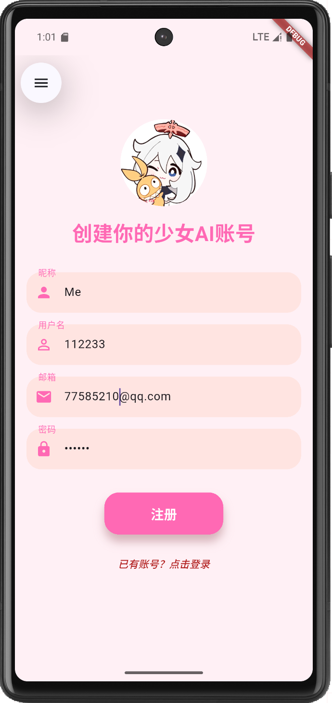
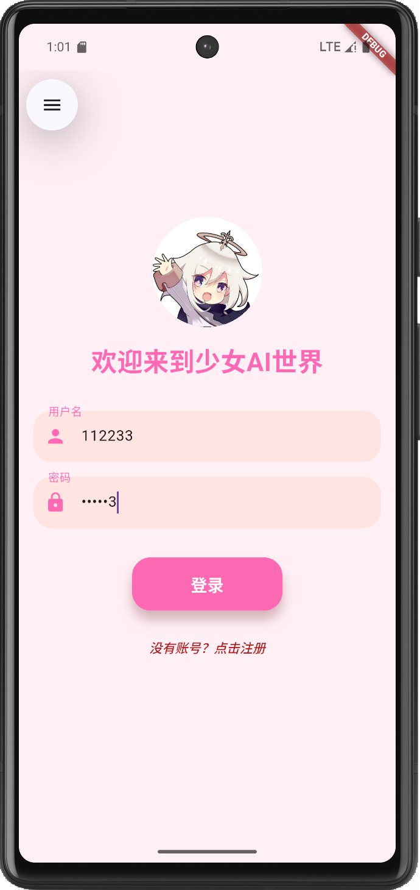
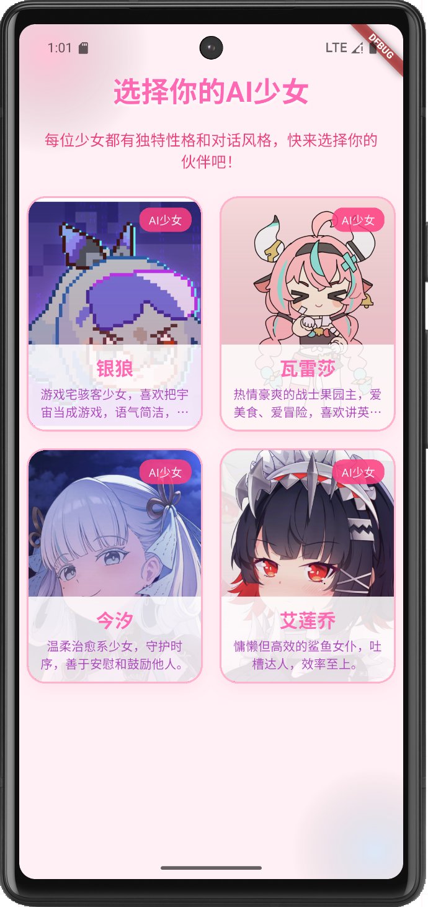
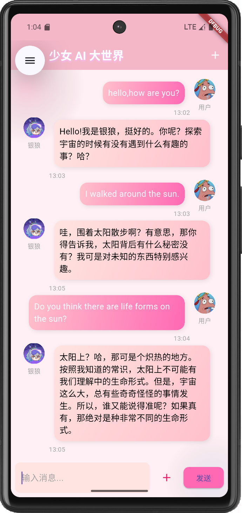
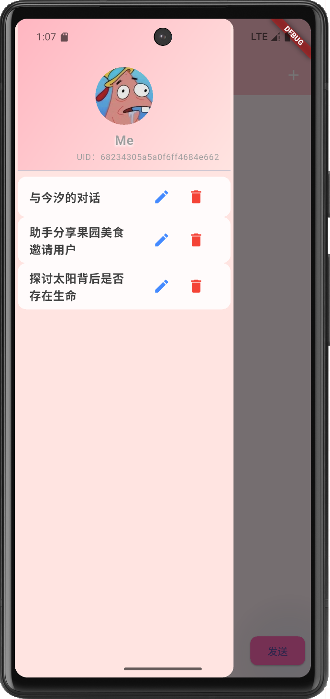
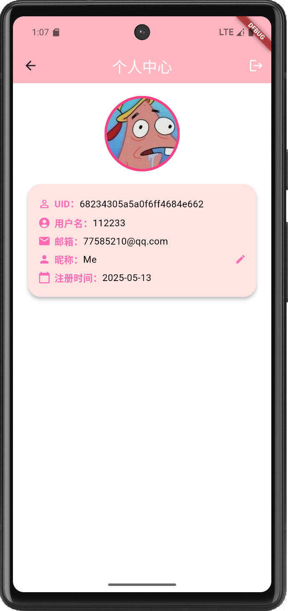

## 设计文档

### 1. 关键功能设计与实现技术

#### 1.1 用户系统
- **功能说明**：支持注册、登录、个人信息管理（头像、昵称、邮箱等），多用户独立对话历史。
- **实现技术**：前端：使用 Flutter 建立页面；后端:使用FastApi和mongodb，实现相应数据的存储，提供RESTful api接口。
- **相关代码**：`login_screen.dart`、`register_screen.dart`、`profile_screen.dart`、`api_service.dart`
- **注册界面**：
- **登录页面**：

#### 1.2 AI人格模型选择
- **功能说明**：用户可自主选择不同AI人格（如“银狼”“今汐”等），每个人格有独特设定和对话风格。
- **实现技术**：前端：模型信息以列表形式展示，点击后初始化对应对话，前端通过 `model_select_screen.dart` 实现；后端：接收传来的initial message并发送给大模型，预先设置其人格。
- **选择模型页面**：

#### 1.3 聊天与历史对话
- **功能说明**：支持消息输入、发送、展示AI回复，自动保存历史对话，可切换、删除历史会话。
- **实现技术**：前端：消息气泡美观，支持头像、模型名展示，历史会话通过侧边栏管理，相关代码见 `chat_screen.dart`、`message_bubble.dart`后端：通过jwt认证保证相应信息只能由当前用户查看。
- **对话页面**：
- **历史对话页面**：

#### 1.4 头像与昵称自定义
- **功能说明**：用户可上传自定义头像，修改昵称。
- **实现技术**：图片上传用 `image_picker`，昵称修改通过弹窗输入，相关接口见 `api_service.dart`。
- **个人页面**：

---
### 2. 组员分工情况

| 姓名   | 主要负责内容                   |
| ------ | ----------------------------- |
| 李承锴   | 前端界面设计与实现（Flutter）  |
| 厉航   | 后端接口设计与实现(FastApi,mongodb)|
---
